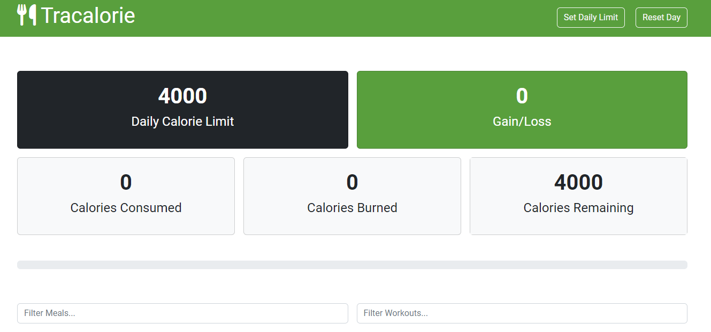
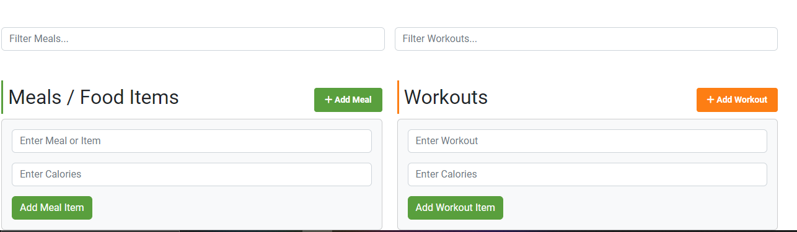
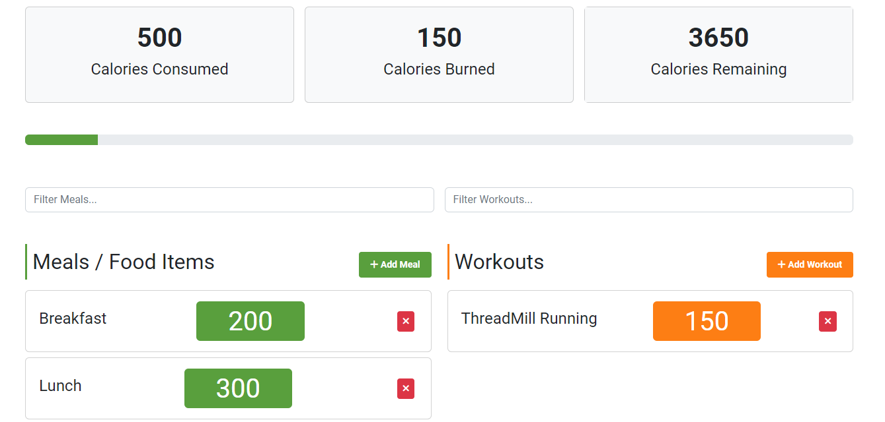

# Tracalorie

Tracalorie is a simple web application for tracking calorie intake and expenditure. Users can add meals and workouts, and the app calculates and displays total calories consumed, burned, and remaining. The data is stored in localStorage, so it persists across sessions.

## Features

- **Calorie Limit**: Set a daily calorie limit.
- **Add Meals**: Log meals with calorie information.
- **Add Workouts**: Log workouts with calorie expenditure.
- **Real-time Updates**: See updates to calories consumed, burned, and remaining.
- **Persistent Data**: Data is stored in localStorage and persists across sessions.
- **Responsive Design**: Accessible on both desktop and mobile devices.
- **Reset Day**: Reset the Entire UI Data to zero.

## Usage

1. **Set Calorie Limit**: Click on the "Set Daily Limit" button and input your daily calorie limit.
2. **Add Meal**: Fill in the meal name and calories in the meal form, then click "Add Meal".
3. **Add Workout**: Fill in the workout name and calories burned in the workout form, then click "Add Workout".
4. **Remove Item**: Click the delete icon next to a meal or workout to remove it.
5. **Reset Day**: Click the "Reset Day" button to reset the day's calorie counts to zero.

## Installation

1. Clone the repository:
   ```sh
   git clone https://github.com/HopSoft-Tech/Tracalorie-App.git
   ```
2. Navigate to the project directory:
   ```sh
   cd tracalorie-app
   ```
3. Open `index.html` in your web browser.

## Code Overview

### Main Classes

- **CalorieTracker**: Manages the overall state, including meals, workouts, and calorie totals.
- **Meal**: Represents a meal with a unique ID, name, and calorie count.
- **Workout**: Represents a workout with a unique ID, name, and calorie expenditure.
- **Storage**: Handles getting and setting items in localStorage.

### Event Handling

- **App**: Initializes the `CalorieTracker`, sets up event listeners for adding and removing items, filtering items, resetting data, and setting calorie limits.

## Screenshots

Here are some screenshots of the application in action:

### Home Page



### Adding a Meal/Workout



### Viewing Meals and Workouts



## Contributing

1. Fork the repository.
2. Create a new branch:
   ```sh
   git checkout -b feature-branch
   ```
3. Make your changes.
4. Commit your changes:
   ```sh
   git commit -m 'Add new feature'
   ```
5. Push to the branch:
   ```sh
   git push origin feature-branch
   ```
6. Open a pull request.

## License

This project is licensed under the MIT License. See the [LICENSE](LICENSE) file for details.
